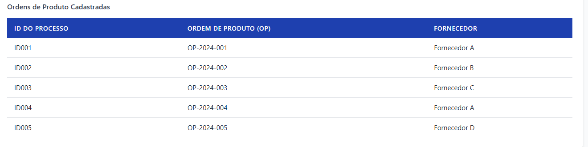

# UI-Path-Interface

Este projeto contém um pequeno banco de dados JSON com 5 Ordens de Produto cadastradas, conforme a tabela abaixo:

Cada ordem possui apenas **ID do Processo**, **Ordem de Produto (OP)** e **Fornecedor** preenchidos. Os demais campos (fatura, valor, datas) ficam vazios para serem preenchidos pelo funcionário no formulário.
